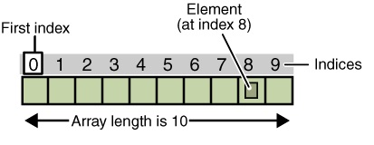

# Tổng quan về các Collection trong Java

## 1. Collection Framework
- Java Collection Framework cung cấp các cấu trúc dữ liệu và thuật toán để lưu trữ và thao tác với các nhóm đối tượng.
- Các interface chính trong Collection Framework bao gồm `Collection`, `List`, `Set`, `Queue`, và `Map`.
- Các class cung cấp các cài đặt cụ thể của các interface trên bao gồm `ArrayList`, `LinkedList`, `HashSet`, `TreeSet`, `HashMap`, `TreeMap`, và nhiều class khác.
- Collection Framework cung cấp các phương thức để thêm, xóa, truy cập, và duyệt các phần tử trong một Collection.
- Collection Framework cung cấp các cấu trúc dữ liệu linh hoạt và hiệu quả để giải quyết các vấn đề phức tạp.
- Collection Framework giúp tối ưu hóa việc lưu trữ và truy cập dữ liệu.

## 2. Array
Mảng (Array) là một cấu trúc dữ liệu cố định, lưu trữ các phần tử có cùng kiểu dữ liệu.<br/>

### Cú pháp
```java
int[] array = new int[10];
```
- Trong đoạn mã trên:
    - `int[]`: kiểu dữ liệu của mảng, bạn có thể thay thế bằng bất kỳ kiểu dữ liệu nguyên thủy (char, long...) hoặc đối tượng nào (String, SinhVien...).
    - `array`: tên biến mảng.
    - `new int[10]`: khởi tạo mảng với 10 phần tử.
- Lưu ý:
  - Mảng trong Java bắt đầu từ index 0.
  - Để truy cập phần tử trong mảng, sử dụng index của phần tử đó, ví dụ `array[0]`, `array[1]`.
  - Để lấy độ dài của mảng, sử dụng thuộc tính `length`, ví dụ `array.length`.
  - Mảng trong Java là một cấu trúc dữ liệu cố định, không thể thay đổi kích thước sau khi khởi tạo.
  - Mảng có thể chứa các kiểu dữ liệu nguyên thủy hoặc đối tượng.
  - Mảng đa chiều là mảng chứa mảng khác.

Ví dụ tương tác với mảng:
```java
int[] numbers = {1, 2, 3, 4, 5};    // Khởi tạo mảng số nguyên.
System.out.println(numbers[0]);      // In ra phần tử đầu tiên của mảng.
System.out.println(numbers.length);  // In ra độ dài của mảng.
```
Ví dụ duyệt mảng:
```java
int[] numbers = {1, 2, 3, 4, 5};    // Khởi tạo mảng số nguyên.
for (int i = 0; i < numbers.length; i++) {
    System.out.println(numbers[i]);
}
```
Ví dụ mảng đa chiều:
```java
int[][] matrix = {
    {1, 2, 3},
    {4, 5, 6},
    {7, 8, 9}
};
System.out.println(matrix[0][0]);    // In ra phần tử ở hàng 0, cột 0.
```

## 3. List
- List là một interface trong Collection Framework, mô tả một danh sách có thứ tự của các phần tử.
- Các class cung cấp cài đặt của List bao gồm `ArrayList`, `LinkedList`, `Vector`, `Stack`.
- List cho phép lưu trữ các phần tử trùng lặp và có thể thay đổi kích thước.
- List cung cấp các phương thức để thêm, xóa, truy cập, và duyệt các phần tử trong danh sách.
- List cung cấp các phương thức để tìm kiếm, sắp xếp, và thay đổi các phần tử trong danh sách.

### Cú pháp
```java
List<Integer> list = new ArrayList<>();
List<String> names = new LinkedList<>();
List<Double> prices = new Vector<>();
List<Boolean> flags = new Stack<>();
```

- Trong đoạn mã trên:
    - `List<Integer>`: kiểu dữ liệu của List, bạn có thể thay thế bằng bất kỳ kiểu dữ liệu nào.
    - `ArrayList<>`: cài đặt của List, bạn có thể thay thế bằng `LinkedList`, `Vector`, `Stack`.
    - `list`: tên biến List.
    - `new ArrayList<>()`: khởi tạo một ArrayList.
- Lưu ý:
  - List trong Java là một cấu trúc dữ liệu linh hoạt, có thể thay đổi kích thước.
  - List có thể chứa các kiểu dữ liệu nguyên thủy hoặc đối tượng.
  - List cung cấp các phương thức để thêm, xóa, truy cập, và duyệt các phần tử trong danh sách.
  - List cung cấp các phương thức để tìm kiếm, sắp xếp, và thay đổi các phần tử trong danh sách.

Ví dụ tương tác với List:
```java
List<Integer> numbers = new ArrayList<>();      // Khởi tạo List số nguyên.
numbers.add(1);                                 // Thêm phần tử vào List.
numbers.add(2);                                 // Thêm phần tử vào List.
System.out.println(numbers.get(0));             // Lấy phần tử đầu tiên của List.
System.out.println(numbers.size());             // Lấy độ dài của List.
```
### Add elements to a List (Thêm phần tử vào List)
```java
List<Integer> numbers = new ArrayList<>();
numbers.add(1);    // Thêm phần tử vào List.
numbers.add(2);    // Thêm phần tử vào List.
numbers.add(3);    // Thêm phần tử vào List.
```
### Access elements in a List (Truy cập phần tử trong List)
```java
List<Integer> numbers = new ArrayList<>();
numbers.add(1);
numbers.add(2);
numbers.add(3);
System.out.println(numbers.get(0));    // Lấy phần tử đầu tiên của List.
```
### Remove elements from a List (Xóa phần tử khỏi List)
```java
List<Integer> numbers = new ArrayList<>();
numbers.add(1);
numbers.add(2);
numbers.add(3);
numbers.remove(0);    // Xóa phần tử đầu tiên của List.
```
### Iterate over a List (Tương tác với List)
```java
List<Integer> numbers = new ArrayList<>();
numbers.add(1);
numbers.add(2);
numbers.add(3);
for (int number : numbers) {
    System.out.println(number);
}
```
### Size of a List (Độ dài của List)
```java
List<Integer> numbers = new ArrayList<>();
numbers.add(1);
numbers.add(2);
numbers.add(3);
System.out.println(numbers.size());    // Lấy độ dài của List.
```

### Sort elements in a List (Sắp xếp các phần tử trong List)
```java
List<Integer> numbers = new ArrayList<>();
numbers.add(3);
numbers.add(1);
numbers.add(2);
Collections.sort(numbers);    // Sắp xếp các phần tử trong List.
```
### Search for an element in a List (Tìm kiếm một phần tử trong List)
```java
List<Integer> numbers = new ArrayList<>();
numbers.add(1);
numbers.add(2);
numbers.add(3);
int index = numbers.indexOf(2);    // Tìm kiếm phần tử 2 trong List.
```
### Lambda expression in a List (Biểu thức lambda trong List)
```java
List<Integer> numbers = Arrays.asList(1, 2, 3, 4, 5);    // Khởi tạo List số nguyên.
numbers.forEach(number -> System.out.println(number));    // In ra các phần tử trong List.
```
### Remove duplicates from a List (Xóa các phần tử trùng lặp khỏi List)
```java
List<Integer> numbers = new ArrayList<>();
numbers.add(1);
numbers.add(2);
numbers.add(1);
Set<Integer> uniqueNumbers = new HashSet<>(numbers);    // Xóa các phần tử trùng lặp khỏi List.
```
## 4. HashMap
- HashMap là một class trong Collection Framework, lưu trữ các cặp key-value không có thứ tự.
- HashMap cho phép lưu trữ các phần tử không trùng lặp và có thể thay đổi kích thước.
- HashMap cung cấp các phương thức để thêm, xóa, truy cập, và duyệt các phần tử trong bảng băm.
- HashMap cung cấp các phương thức để tìm kiếm, sắp xếp, và thay đổi các phần tử trong bảng băm.
- HashMap cung cấp hiệu suất tốt cho việc truy cập, thêm, và xóa phần tử.
- HashMap không đảm bảo thứ tự của các phần tử.

### Cú pháp
```java
Map<String, Integer> map = new HashMap<>();
```
- Trong đoạn mã trên:
  - `Map<String, Integer>`: kiểu dữ liệu của Map, bạn có thể thay thế bằng bất kỳ kiểu dữ liệu nào, bạn có thể sử dụng kiểu dữ liệu nguyên thủy hoặc đối tượng.
    - `String`: kiểu dữ liệu của key.
    - `Integer`: kiểu dữ liệu của value.
  - `HashMap<>`: cài đặt của Map, bạn có thể thay thế bằng `LinkedHashMap`, `TreeMap`.
  - `map`: tên biến Map.

- Lưu ý:
  - HashMap trong Java là một cấu trúc dữ liệu linh hoạt, có thể thay đổi kích thước.
  
### Add elements to a HashMap (Thêm phần tử vào HashMap)
```java
Map<String, Integer> map = new HashMap<>();
map.put("One", 1);    // Thêm phần tử vào HashMap.
map.put("Two", 2);    // Thêm phần tử vào HashMap.
```
### Access elements in a HashMap (Truy cập phần tử trong HashMap)
```java
Map<String, Integer> map = new HashMap<>();
map.put("One", 1);
map.put("Two", 2);
System.out.println(map.get("One"));    // Lấy giá trị của key "One".
```
### Remove elements from a HashMap (Xóa phần tử khỏi HashMap)
```java
Map<String, Integer> map = new HashMap<>();
map.put("One", 1);
map.put("Two", 2);
map.remove("One");    // Xóa phần tử có key "One".
```
### Iterate over a HashMap (Tương tác với HashMap)
```java
Map<String, Integer> map = new HashMap<>();
map.put("One", 1);
map.put("Two", 2);
for (Map.Entry<String, Integer> entry : map.entrySet()) {
    System.out.println(entry.getKey() + ": " + entry.getValue());
}
```
### Size of a HashMap (Độ dài của HashMap)
```java
Map<String, Integer> map = new HashMap<>();
map.put("One", 1);
map.put("Two", 2);
System.out.println(map.size());    // Lấy độ dài của HashMap.
```
### Sort elements in a HashMap (Sắp xếp các phần tử trong HashMap)
```java
Map<String, Integer> map = new HashMap<>();
map.put("One", 1);
map.put("Two", 2);
Map<String, Integer> sortedMap = new TreeMap<>(map);    // Sắp xếp các phần tử trong HashMap.
```
### Search for an element in a HashMap (Tìm kiếm một phần tử trong HashMap)
```java
Map<String, Integer> map = new HashMap<>();
map.put("One", 1);
map.put("Two", 2);
boolean containsKey = map.containsKey("One");    // Kiểm tra xem HashMap có chứa key "One" không.
```
### Lambda expression in a HashMap (Biểu thức lambda trong HashMap)
```java
Map<String, Integer> map = new HashMap<>();
map.put("One", 1);
map.put("Two", 2);
map.forEach((key, value) -> System.out.println(key + ": " + value));    // In ra các phần tử trong HashMap.
```

## 5. Tóm tắt
- Collection Framework cung cấp các cấu trúc dữ liệu và thuật toán để lưu trữ và thao tác với các nhóm đối tượng.
- Các interface chính trong Collection Framework bao gồm `Collection`, `List`, `Set`, `Queue`, và `Map`.
- Các class cung cấp các cài đặt cụ thể của các interface trên bao gồm `ArrayList`, `LinkedList`, `HashSet`, `TreeSet`, `HashMap`, `TreeMap`, và nhiều class khác.
- Collection Framework cung cấp các phương thức để thêm, xóa, truy cập, và duyệt các phần tử trong một Collection.

